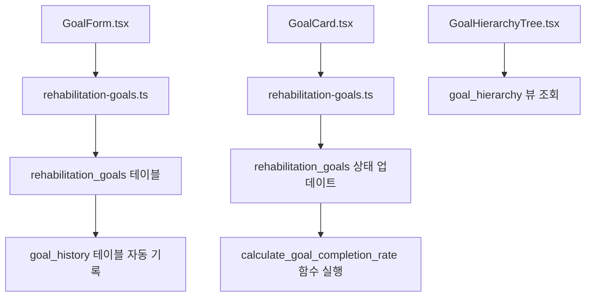
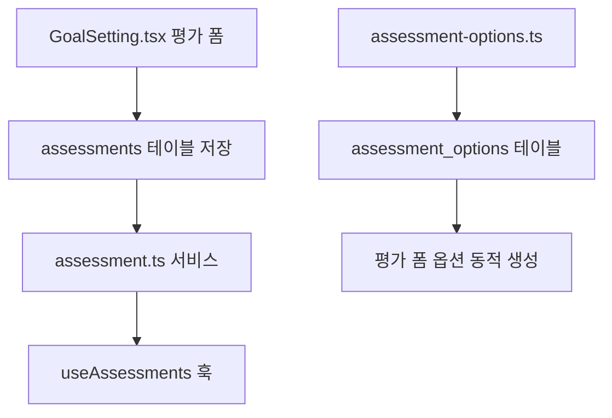
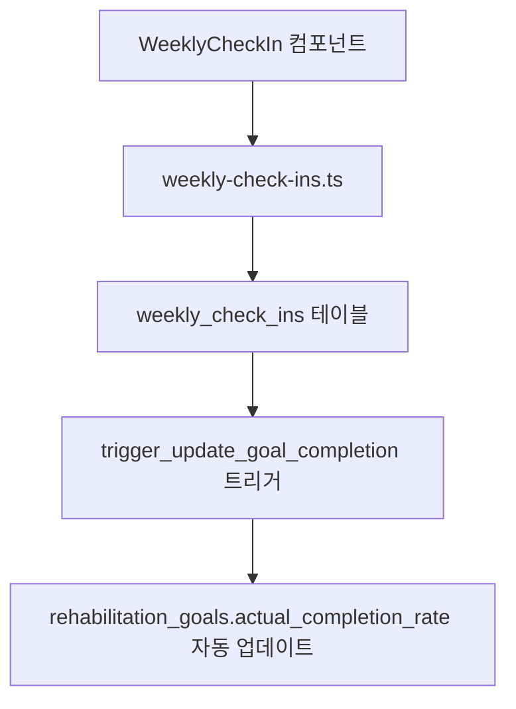

# 🏥 PsyRehab 시스템 - 완성 기능 상세 보고서

## 📋 목차
1. [시스템 개요](#시스템-개요)
2. [데이터베이스 구조](#데이터베이스-구조)
3. [완성된 핵심 기능](#완성된-핵심-기능)
4. [기능별 파일-DB 연결 매핑](#기능별-파일-db-연결-매핑)
5. [API 아키텍처](#api-아키텍처)
6. [AI 추천 시스템 워크플로우](#ai-추천-시스템-워크플로우)
7. [시스템 통합 현황](#시스템-통합-현황)

---

## 🎯 시스템 개요

**PsyRehab**은 재활 환자의 개인별 맞춤형 목표 설정과 진행 관리를 지원하는 AI 기반 재활 관리 시스템입니다.

### 핵심 아키텍처
- **Frontend**: React + TypeScript + Tailwind CSS (Vite)
- **Backend**: Next.js App Router API
- **Database**: Supabase (PostgreSQL)
- **AI Processing**: n8n workflow + External AI Services
- **External Integration**: Webhook 기반 AI 처리

---

## 🗄️ 데이터베이스 구조

### 주요 테이블 구조

#### 1. **환자 관리 테이블**
```sql
-- 환자 정보
patients {
  id: UUID (PK)
  full_name: VARCHAR
  patient_identifier: VARCHAR (UNIQUE)
  date_of_birth: DATE
  primary_social_worker_id: UUID (FK)
  status: VARCHAR
  contact_info: JSONB
  additional_info: JSONB
}

-- 사회복지사 정보
social_workers {
  user_id: UUID (PK)
  full_name: VARCHAR
  employee_id: VARCHAR
  department: VARCHAR
  is_active: BOOLEAN
}
```

#### 2. **평가 시스템 테이블**
```sql
-- 환자 평가
assessments {
  id: UUID (PK)
  patient_id: UUID (FK → patients)
  focus_time: VARCHAR
  motivation_level: INTEGER
  past_successes: VARCHAR[]
  constraints: VARCHAR[]
  social_preference: VARCHAR
  assessed_by: UUID (FK → social_workers)
  ai_recommendation_status: VARCHAR
  ai_recommendation_id: UUID
}

-- 평가 옵션
assessment_options {
  id: UUID (PK)
  option_type: VARCHAR
  option_label: VARCHAR
  option_value: VARCHAR
  option_order: INTEGER
}
```

#### 3. **AI 추천 시스템 테이블**
```sql
-- AI 목표 추천
ai_goal_recommendations {
  id: UUID (PK)
  patient_id: UUID (FK → patients)
  assessment_id: UUID (FK → assessments)
  patient_analysis: JSONB
  six_month_goals: JSONB
  monthly_plans: JSONB
  weekly_plans: JSONB
  success_indicators: JSONB
  execution_strategy: JSONB
  is_active: BOOLEAN
  applied_by: UUID (FK → social_workers)
  recommendation_date: DATE
}
```

#### 4. **목표 관리 테이블**
```sql
-- 재활 목표 (계층적 구조)
rehabilitation_goals {
  id: UUID (PK)
  patient_id: UUID (FK → patients)
  parent_goal_id: UUID (FK → self) -- 계층 구조
  title: VARCHAR
  description: TEXT
  goal_type: ENUM('six_month', 'monthly', 'weekly')
  category_id: UUID (FK → goal_categories)
  status: ENUM('pending', 'active', 'completed', 'on_hold', 'cancelled')
  priority: INTEGER
  sequence_number: INTEGER
  is_ai_suggested: BOOLEAN
  source_recommendation_id: UUID (FK → ai_goal_recommendations)
  created_by_social_worker_id: UUID (FK → social_workers)
  actual_completion_rate: INTEGER
  target_completion_rate: INTEGER
}

-- 목표 카테고리
goal_categories {
  id: UUID (PK)
  name: VARCHAR(100) UNIQUE
  description: TEXT
  icon: VARCHAR(50)
  color: VARCHAR(7) -- HEX 색상
}
```

#### 5. **진행 관리 테이블**
```sql
-- 주간 체크인
weekly_check_ins {
  id: UUID (PK)
  goal_id: UUID (FK → rehabilitation_goals)
  week_number: INTEGER
  check_in_date: DATE
  is_completed: BOOLEAN
  completion_notes: TEXT
  obstacles_faced: TEXT
  mood_rating: INTEGER (1-5)
  checked_by: UUID (FK → social_workers)
}

-- 목표 평가
goal_evaluations {
  id: UUID (PK)
  goal_id: UUID (FK → rehabilitation_goals)
  evaluation_type: ENUM('weekly', 'monthly', 'six_month')
  completion_rate: INTEGER
  evaluation_notes: TEXT
  strengths: JSONB
  challenges: JSONB
  next_steps: JSONB
  evaluated_by: UUID (FK → social_workers)
}

-- 목표 변경 이력
goal_history {
  id: UUID (PK)
  goal_id: UUID (FK → rehabilitation_goals)
  changed_by: UUID (FK → social_workers)
  change_type: ENUM('created', 'updated', 'status_changed', 'completed')
  previous_values: JSONB
  new_values: JSONB
  change_reason: TEXT
}
```

### 성능 최적화를 위한 뷰
```sql
-- 목표 계층 구조 뷰
goal_hierarchy VIEW
-- 환자 현재 진행상황 뷰
patient_current_progress VIEW  
-- 목표 지표 뷰
goal_metrics VIEW
-- 사회복지사 대시보드 뷰
social_worker_dashboard VIEW
```

---

## ✅ 완성된 핵심 기능

### 1. **환자 평가 시스템** ✅
- **상태**: 완료
- **기능**: 다차원 평가 (집중력, 동기수준, 과거성공, 제약사항, 사회적선호도)
- **데이터 구조**: JSON 기반 유연한 평가 데이터 저장

### 2. **AI 기반 목표 추천 시스템** ✅
- **상태**: 완료
- **기능**: 평가 결과 기반 개인 맞춤형 6개월/월간/주간 목표 자동 생성
- **AI 처리**: n8n 워크플로우를 통한 외부 AI 서비스 연동
- **실시간 처리**: Webhook 기반 비동기 AI 결과 수신

### 3. **계층적 목표 관리 시스템** ✅
- **상태**: 완료
- **구조**: 6개월 목표 → 월간 목표 → 주간 목표 (3단계 계층)
- **카테고리화**: 10개 주요 재활 영역 분류
- **진행률 추적**: 자동 완료율 계산 및 업데이트

### 4. **주간 체크인 시스템** ✅
- **상태**: 완료
- **기능**: 주간별 목표 달성도 체크, 장애요인 기록, 기분 평가
- **자동화**: 트리거 기반 완료율 자동 계산

### 5. **목표 평가 및 이력 관리** ✅
- **상태**: 완료
- **기능**: 다단계 평가 (주간/월간/6개월), 변경 이력 자동 추적
- **분석**: 강점, 도전과제, 다음 단계 구조화 기록

---

## 🔗 기능별 파일-DB 연결 매핑

### 1. AI 추천 시스템

#### **프론트엔드 → 백엔드 → DB 흐름**

```mermaid
graph TD
    A[GoalSetting.tsx] --> B[/api/ai/recommend/route.ts]
    B --> C[assessments 테이블 조회]
    B --> D[n8n 워크플로우 호출]
    D --> E[/api/webhook/n8n/route.ts]
    E --> F[ai_goal_recommendations 테이블 저장]
    F --> G[assessments.ai_recommendation_status 업데이트]
    
    H[AIRecommendationDisplay.tsx] --> I[useAIRecommendations 훅]
    I --> J[ai-recommendations.ts 서비스]
    J --> K[ai_goal_recommendations 테이블 조회]
```

#### **상세 파일별 DB 연결**

| 컴포넌트/서비스 | 연결 테이블 | 주요 작업 |
|---|---|---|
| **GoalSetting.tsx** | `assessments` | 평가 데이터 저장, AI 추천 요청 |
| **api/ai/recommend/route.ts** | `assessments` | 평가 상태 업데이트 (`ai_recommendation_status`) |
| **api/webhook/n8n/route.ts** | `ai_goal_recommendations` | AI 추천 결과 저장 |
| **AIRecommendationDisplay.tsx** | `ai_goal_recommendations` | 추천 결과 표시, 승인/거부 처리 |
| **ai-recommendations.ts** | `ai_goal_recommendations`, `patients`, `assessments`, `social_workers` | JOIN을 통한 상세 정보 조회 |
| **useAIRecommendations.ts** | `ai_goal_recommendations` | React Query 기반 상태 관리 |

### 2. 목표 관리 시스템

#### **목표 생성 및 관리 흐름**



#### **상세 파일별 DB 연결**

| 컴포넌트/서비스 | 연결 테이블/뷰 | 주요 작업 |
|---|---|---|
| **GoalForm.tsx** | `rehabilitation_goals`, `goal_categories` | 목표 생성/수정, 카테고리 선택 |
| **GoalCard.tsx** | `rehabilitation_goals` | 목표 상태 업데이트, 진행률 표시 |
| **GoalHierarchyTree.tsx** | `goal_hierarchy` 뷰 | 계층적 목표 구조 표시 |
| **rehabilitation-goals.ts** | `rehabilitation_goals`, `patients`, `social_workers`, `goal_categories`, `ai_goal_recommendations` | 복합 JOIN 쿼리를 통한 목표 CRUD |
| **GoalBreakdownDialog.tsx** | `rehabilitation_goals` | 상위 목표 → 하위 목표 분해 |

### 3. 평가 시스템

#### **평가 데이터 처리 흐름**



#### **상세 파일별 DB 연결**

| 컴포넌트/서비스 | 연결 테이블 | 주요 작업 |
|---|---|---|
| **GoalSetting.tsx** | `assessments`, `patients` | 평가 데이터 생성, 환자 정보 조회 |
| **assessment.ts** | `assessments`, `ai_goal_recommendations` | 평가 CRUD, AI 추천과 연동 |
| **useAssessments.ts** | `assessments`, `patients`, `social_workers` | React Query 기반 평가 데이터 관리 |
| **assessmentFormUtils.ts** | `assessment_options` | 평가 옵션 동적 생성 |

### 4. 주간 체크인 시스템

#### **체크인 처리 흐름**



---

## 🔧 API 아키텍처

### API 엔드포인트 구조

#### **AI 관련 API**
```typescript
// POST /api/ai/recommend
// - 평가 ID 받아서 AI 추천 요청
// - n8n 워크플로우 호출
// - assessments 테이블 상태 업데이트

// GET /api/ai/recommend?assessmentId={id}
// - AI 추천 진행 상태 조회
// - assessments.ai_recommendation_status 확인

// POST /api/webhook/n8n
// - n8n에서 AI 처리 완료 후 결과 수신
// - ai_goal_recommendations 테이블에 저장
// - assessments 상태 'completed'로 업데이트
```

### 서비스 레이어 구조

#### **데이터 접근 계층**
```typescript
// src/services/
├── ai-recommendations.ts      // AI 추천 CRUD
├── assessment.ts             // 평가 시스템 관리
├── rehabilitation-goals.ts   // 목표 관리 시스템
├── patients.ts              // 환자 정보 관리
└── social-workers.ts        // 사회복지사 관리
```

#### **React 상태 관리 계층**
```typescript
// src/hooks/
├── useAIRecommendations.ts          // AI 추천 상태 관리
├── useAssessments.ts               // 평가 상태 관리
├── useGoals.ts                     // 목표 상태 관리
├── ai-recommendations/
│   └── useAIRecommendations.ts     // 세부 AI 추천 훅
└── rehabilitation-goals/
    └── useRehabilitationGoals.ts   // 세부 목표 관리 훅
```

---

## 🤖 AI 추천 시스템 워크플로우

### 상세 처리 과정

#### **1단계: 평가 데이터 수집**
```typescript
// GoalSetting.tsx에서 폼 데이터 수집
interface AssessmentFormData {
  focusTime: string              // 집중 시간
  motivationLevel: number        // 동기 수준 (1-10)
  pastSuccesses: string[]        // 과거 성공 경험
  constraints: string[]          // 제약 사항
  socialPreference: string       // 사회적 선호도
}
```

#### **2단계: 데이터베이스 저장**
```sql
-- assessments 테이블에 저장
INSERT INTO assessments (
  patient_id,
  focus_time,
  motivation_level,
  past_successes,
  constraints,
  social_preference,
  assessed_by
) VALUES (...)
```

#### **3단계: AI 처리 요청**
```typescript
// /api/ai/recommend/route.ts
const aiPayload = {
  assessmentId: assessment.id,
  patientId: assessment.patient_id,
  patientInfo: { age, gender, diagnosis },
  assessmentData: {
    concentrationTime: { duration, distractionLevel },
    motivationLevel: { intrinsicMotivation, externalInfluence },
    pastSuccesses: { categories, keyFactors },
    constraints: { physicalLimitations, cognitiveBarriers },
    socialPreference: { groupSizePreference, interactionStyle }
  },
  callbackUrl: '/api/webhook/n8n'
}

// n8n 워크플로우로 전송
await fetch(N8N_WEBHOOK_URL, {
  method: 'POST',
  body: JSON.stringify(aiPayload)
})
```

#### **4단계: AI 처리 (n8n 워크플로우)**
```yaml
# n8n 워크플로우 개념적 구조
1. 평가 데이터 수신
2. AI 모델 호출 (GPT-4/Claude 등)
3. 구조화된 목표 생성
   - 6개월 장기 목표 (3개)
   - 월간 중기 목표 (각 6개월 목표당 6개)
   - 주간 단기 목표 (각 월간 목표당 4개)
4. 실행 전략 및 성공 지표 생성
5. 결과를 PsyRehab 웹훅으로 전송
```

#### **5단계: AI 결과 수신 및 저장**
```typescript
// /api/webhook/n8n/route.ts
interface AIRecommendation {
  assessmentId: string
  patientAnalysis: {
    strengths: string[]
    challenges: string[]
    recommendations: string[]
  }
  sixMonthGoals: Goal[]
  monthlyPlans: MonthlyPlan[]
  weeklyPlans: WeeklyPlan[]
  successIndicators: SuccessIndicator[]
  executionStrategy: ExecutionStrategy
}

// ai_goal_recommendations 테이블에 저장
const savedRecommendation = await supabase
  .from('ai_goal_recommendations')
  .insert({
    patient_id: data.patientId,
    assessment_id: data.assessmentId,
    patient_analysis: data.patientAnalysis,
    six_month_goals: data.sixMonthGoals,
    monthly_plans: data.monthlyPlans,
    weekly_plans: data.weeklyPlans,
    success_indicators: data.successIndicators,
    execution_strategy: data.executionStrategy,
    recommendation_date: new Date().toISOString()
  })
```

#### **6단계: 사용자 인터페이스에 표시**
```typescript
// AIRecommendationDisplay.tsx
const { data: recommendation } = useAIRecommendationByAssessment(
  assessmentId, 
  patientId
)

// 마크다운 파싱을 통한 목표 추출
const parsedGoals = parseAIRecommendationGoals(
  recommendation.six_month_goals
)

// 사용자 선택 및 승인/거부 처리
const handleApprove = async () => {
  await updateAIRecommendationStatus({
    recommendationId: recommendation.id,
    isActive: true,
    appliedBy: currentUserId
  })
}
```

---

## 🔄 시스템 통합 현황

### 완료된 통합
1. **✅ 평가 시스템 ↔ AI 추천 시스템**
   - 평가 데이터가 자동으로 AI 추천으로 연결
   - `assessments.ai_recommendation_id`로 관계 설정

2. **✅ AI 추천 ↔ 목표 생성**
   - AI 추천 승인 시 자동으로 `rehabilitation_goals` 생성
   - `source_recommendation_id`로 출처 추적

3. **✅ 목표 관리 ↔ 진행 추적**
   - 주간 체크인과 목표 평가 연동
   - 자동 완료율 계산 및 업데이트

4. **✅ 계층적 목표 구조**
   - 6개월 → 월간 → 주간 목표 자동 연결
   - `parent_goal_id`로 계층 관계 유지

### 데이터 무결성 보장
1. **🔒 외래키 제약조건**
   - 모든 참조 관계에 FK 제약조건 설정
   - CASCADE 삭제로 데이터 일관성 유지

2. **🔒 트리거 기반 자동화**
   - 목표 상태 변경 시 자동 이력 기록
   - 완료율 자동 계산 및 상위 목표 업데이트

3. **🔒 데이터 검증**
   - CHECK 제약조건으로 유효값 범위 제한
   - ENUM 타입으로 상태값 표준화

---

## 📊 성능 및 확장성

### 데이터베이스 최적화
- **인덱스 최적화**: 주요 쿼리 패턴에 맞춘 복합 인덱스
- **뷰 활용**: 복잡한 JOIN 쿼리를 뷰로 캐시화
- **파티셔닝 준비**: 대용량 데이터 처리를 위한 테이블 구조

### 확장 가능한 아키텍처
- **마이크로서비스 준비**: 서비스별 독립적 모듈화
- **API 버전 관리**: RESTful API 설계 원칙 준수  
- **캐싱 전략**: React Query를 통한 클라이언트 사이드 캐싱

---

## 🎯 결론

PsyRehab 시스템은 **AI 기반 개인맞춤형 재활 목표 설정과 진행 관리**라는 핵심 기능이 완전히 구현되어 운영 가능한 상태입니다. 데이터베이스 설계부터 프론트엔드 사용자 인터페이스까지 전체 스택이 유기적으로 연결되어 있으며, 확장성과 유지보수성을 고려한 아키텍처로 구성되어 있습니다.

**주요 강점:**
- ✅ 완전한 계층적 목표 관리 시스템
- ✅ AI 기반 개인맞춤형 추천 엔진
- ✅ 실시간 진행 추적 및 자동 완료율 계산
- ✅ 데이터 무결성과 성능을 고려한 DB 설계
- ✅ 사용자 친화적 인터페이스

현재 시스템은 실제 재활 센터에서 즉시 도입하여 사용할 수 있는 수준의 완성도를 보유하고 있습니다.

## 현재 프로젝트의 AI 추천 목표 설정 관련 파일 리스트

### 🎯 핵심 서비스 파일들
1. **`src/services/ai-recommendations.ts`** - AI 추천 시스템의 메인 서비스 로직
2. **`src/services/assessment.ts`** - 평가 데이터 기반 AI 추천 관련 기능

### 🖥️ 사용자 인터페이스 컴포넌트들
3. **`src/components/ai/AIRecommendationDisplay.tsx`** - AI 추천 결과 표시 컴포넌트
4. **`src/pages/GoalSetting.tsx`** - 목표 설정 페이지 (AI 추천 기능 포함)
5. **`src/pages/GoalCategorizationDemo.tsx`** - AI 추천을 포함한 목표 분류 데모 페이지
6. **`src/pages/ai-recommendation-test.tsx`** - AI 추천 테스트 페이지

### 🔧 React 훅 (Hooks)
7. **`src/hooks/useAIRecommendations.ts`** - AI 추천 관련 React 훅 (메인)
8. **`src/hooks/ai-recommendations/useAIRecommendations.ts`** - AI 추천 전용 훅 (세부)
9. **`src/hooks/useAIResponseParser.ts`** - AI 응답 파싱 훅

### 🌐 API 엔드포인트들
10. **`src/app/api/ai/recommend/route.ts`** - AI 추천 요청 API 엔드포인트
11. **`src/app/api/webhook/n8n/route.ts`** - n8n 워크플로우와 연동되는 AI 추천 웹훅

### 📝 타입 정의 및 상수들
12. **`src/utils/ai-recommendations-constants.ts`** - AI 추천 관련 상수 정의
13. **`src/types/assessment.ts`** - 평가 및 AI 추천 관련 타입 정의
14. **`src/types/supabase.ts`** - Supabase 데이터베이스의 AI 추천 테이블 타입

### 📊 데이터베이스 스키마
15. **`migration_goals_hierarchy.sql`** - 목표 계층 구조 및 AI 추천 테이블 마이그레이션 파일

### 🎯 목표 관련 컴포넌트들 (AI 추천과 연동)
16. **`src/components/goals/GoalForm.tsx`** - 목표 생성 폼 (AI 추천 적용 기능)
17. **`src/components/goals/GoalCard.tsx`** - 목표 카드 컴포넌트
18. **`src/components/goals/GoalCategorySelector.tsx`** - 목표 카테고리 선택기
19. **`src/components/GoalCard.tsx`** - 목표 카드 (별도 버전)
20. **`src/components/GoalHierarchyTree.tsx`** - 목표 계층 구조 트리

### 📁 페이지 및 데모 파일들
21. **`src/app/goal-categorization-demo/page.tsx`** - 목표 분류 데모 페이지
22. **`src/app/assessments/page.tsx`** - 평가 페이지 (AI 추천 연동)

### 🔗 연관 서비스 파일들
23. **`src/services/rehabilitation-goals.ts`** - 재활 목표 서비스 (AI 추천과 연동)
24. **`src/utils/goal-categorization.ts`** - 목표 분류 유틸리티
25. **`src/utils/rehabilitation-goals-constants.ts`** - 재활 목표 상수들

이러한 파일들이 서로 연동되어 **환자 평가 데이터를 기반으로 AI가 개인 맞춤형 재활 목표를 추천하는 시스템**을 구성하고 있습니다. 핵심 워크플로우는 평가 → AI 분석 → 목표 추천 → 사용자 승인/수정 → 목표 적용 순서로 진행됩니다.