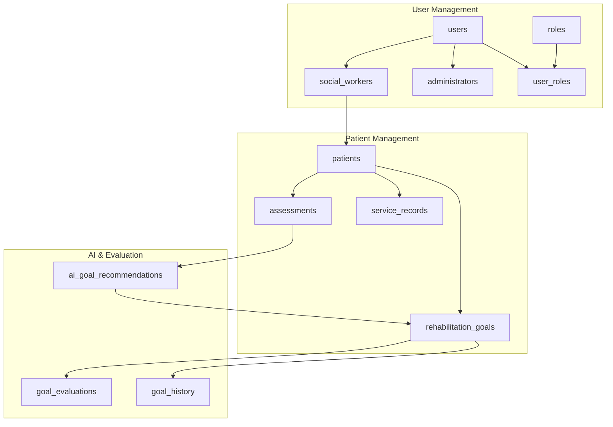
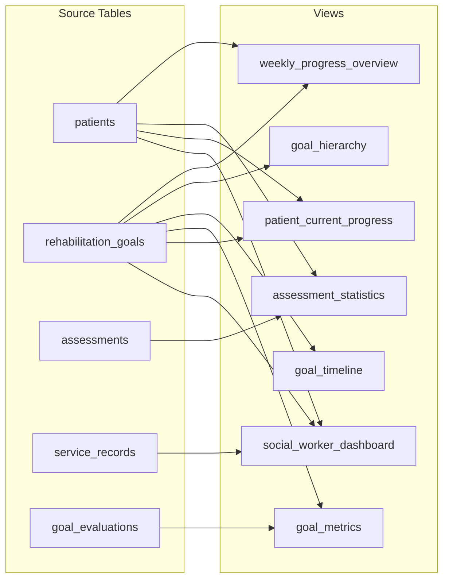

# PsyRehab Database Entity Relationship Diagram

## Database Schema Overview

This document visualizes the database structure of the PsyRehab system, showing tables, relationships, and key fields.

## 1. Complete Entity Relationship Diagram

```mermaid
erDiagram
    users ||--o| social_workers : "has profile"
    users ||--o| administrators : "has profile"
    users ||--o{ user_roles : "has roles"
    roles ||--o{ user_roles : "assigned to"
    
    social_workers ||--o{ patients : "manages"
    patients ||--o{ assessments : "has"
    patients ||--o{ rehabilitation_goals : "has"
    patients ||--o{ service_records : "receives"
    patients ||--o{ weekly_check_ins : "completes"
    
    assessments ||--o{ ai_goal_recommendations : "generates"
    ai_goal_recommendations ||--o{ rehabilitation_goals : "creates"
    
    rehabilitation_goals ||--o{ goal_evaluations : "evaluated by"
    rehabilitation_goals ||--o{ goal_history : "tracks changes"
    rehabilitation_goals ||--o| rehabilitation_goals : "parent-child"
    rehabilitation_goals }o--|| goal_categories : "categorized by"
    
    assessment_options ||--o{ assessments : "used in"

    users {
        uuid id PK
        string email
        timestamp created_at
        timestamp last_sign_in_at
    }

    social_workers {
        uuid id PK
        uuid user_id FK
        string name
        string employee_number
        string phone
        string department
        string position
        timestamp created_at
    }

    administrators {
        uuid id PK
        uuid user_id FK
        string name
        string employee_number
        string phone
        string department
        string position
        timestamp created_at
    }

    patients {
        uuid id PK
        string name
        string gender
        int age
        string address
        string phone
        uuid social_worker_id FK
        string status
        text notes
        timestamp created_at
        timestamp updated_at
    }

    assessments {
        uuid id PK
        uuid patient_id FK
        uuid social_worker_id FK
        int motivation_for_treatment
        int focus_time_30min
        int focus_time_1hour
        boolean social_preference_group
        boolean social_preference_alone
        int constraints_physical
        int constraints_cognitive
        int constraints_environmental
        int constraints_time
        int constraints_economic
        int weekly_sessions
        text notes
        timestamp created_at
    }

    rehabilitation_goals {
        uuid id PK
        uuid patient_id FK
        uuid category_id FK
        string type
        string content
        date start_date
        date target_date
        string status
        uuid parent_goal_id FK
        int position
        boolean is_ai_recommended
        timestamp created_at
        timestamp updated_at
    }

    ai_goal_recommendations {
        uuid id PK
        uuid assessment_id FK
        uuid patient_id FK
        json goals_6month
        json goals_monthly
        json goals_weekly
        string status
        timestamp created_at
        timestamp completed_at
    }

    goal_evaluations {
        uuid id PK
        uuid goal_id FK
        uuid evaluator_id FK
        string status
        text evaluation_notes
        int achievement_percentage
        timestamp evaluated_at
    }

    service_records {
        uuid id PK
        uuid patient_id FK
        uuid social_worker_id FK
        date service_date
        time start_time
        time end_time
        string service_type
        text service_content
        text notes
        timestamp created_at
    }

    weekly_check_ins {
        uuid id PK
        uuid patient_id FK
        date week_start_date
        boolean is_checked
        timestamp checked_at
        uuid checked_by FK
        text notes
    }

    goal_history {
        uuid id PK
        uuid goal_id FK
        uuid changed_by FK
        string change_type
        json old_values
        json new_values
        timestamp changed_at
    }

    roles {
        uuid id PK
        string name
        string display_name
        int hierarchy_level
        json permissions
        timestamp created_at
    }

    user_roles {
        uuid id PK
        uuid user_id FK
        uuid role_id FK
        timestamp assigned_at
    }

    goal_categories {
        uuid id PK
        string name
        string description
        int display_order
        timestamp created_at
    }

    assessment_options {
        uuid id PK
        string category
        string option_key
        string option_value
        int display_order
        boolean is_active
    }
```

## 2. Core Relationships Simplified

## 3. Database Views

## 4. Key Relationships Explained

### User System
- **users** ↔ **social_workers**: One-to-one relationship for social worker profiles
- **users** ↔ **administrators**: One-to-one relationship for admin profiles
- **users** ↔ **user_roles** ↔ **roles**: Many-to-many relationship for role assignments

### Patient Management
- **social_workers** → **patients**: One-to-many relationship (one social worker manages multiple patients)
- **patients** → **assessments**: One-to-many relationship (multiple assessments per patient)
- **patients** → **rehabilitation_goals**: One-to-many relationship (multiple goals per patient)
- **patients** → **service_records**: One-to-many relationship (multiple service records per patient)

### Goal Hierarchy
- **rehabilitation_goals** → **rehabilitation_goals**: Self-referencing for parent-child relationships
- Types: 6_month → monthly → weekly hierarchy

### AI Integration
- **assessments** → **ai_goal_recommendations**: One-to-many relationship
- **ai_goal_recommendations** → **rehabilitation_goals**: Recommendations create actual goals

### Audit & History
- **rehabilitation_goals** → **goal_history**: Tracks all changes to goals
- **rehabilitation_goals** → **goal_evaluations**: Tracks evaluation history

## 5. Data Types and Constraints

### Common Fields
- **id**: UUID primary key (all tables)
- **created_at**: Timestamp with timezone
- **updated_at**: Timestamp with timezone (where applicable)

### Status Enums
- **patients.status**: 'active' | 'pending' | 'completed'
- **rehabilitation_goals.status**: 'active' | 'completed' | 'cancelled' | 'on_hold'
- **rehabilitation_goals.type**: '6_month' | 'monthly' | 'weekly'
- **ai_goal_recommendations.status**: 'pending' | 'completed' | 'failed'

### Key Constraints
- Foreign key constraints with CASCADE delete for child records
- Unique constraints on email (users), employee_number (social_workers, administrators)
- Check constraints on numeric ranges (age, achievement_percentage)

## 6. Deprecated Tables

The following tables are marked as deprecated and should not be used:
- **goal_categories**: Goal categorization system (removed)
- **weekly_check_ins**: Weekly check-in system (deprecated)