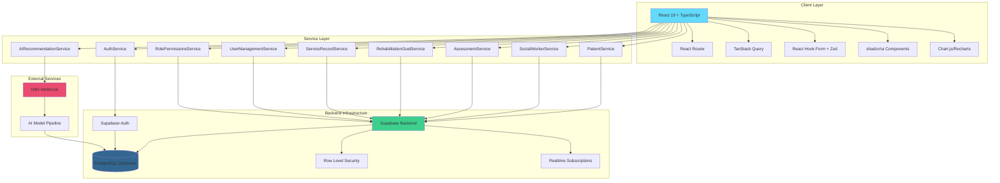
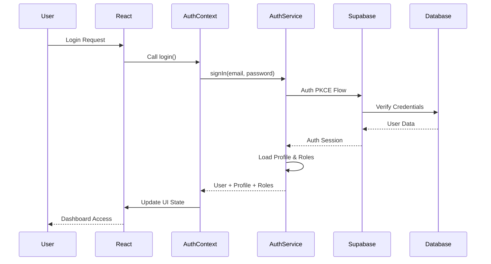
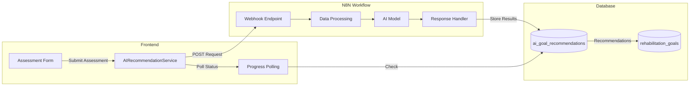
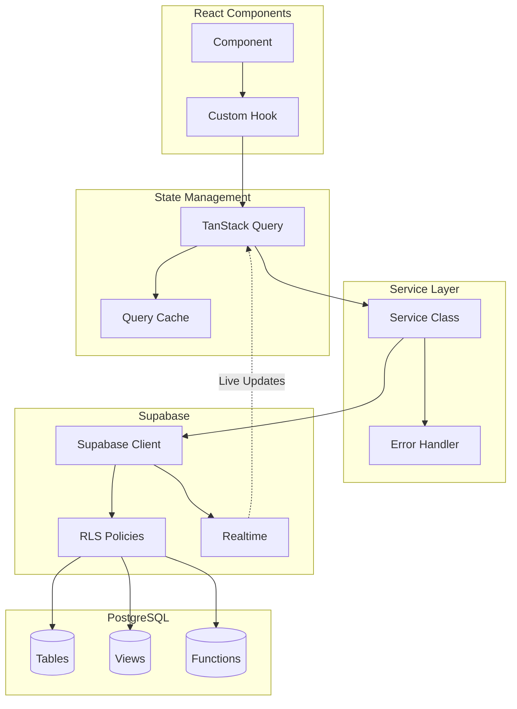
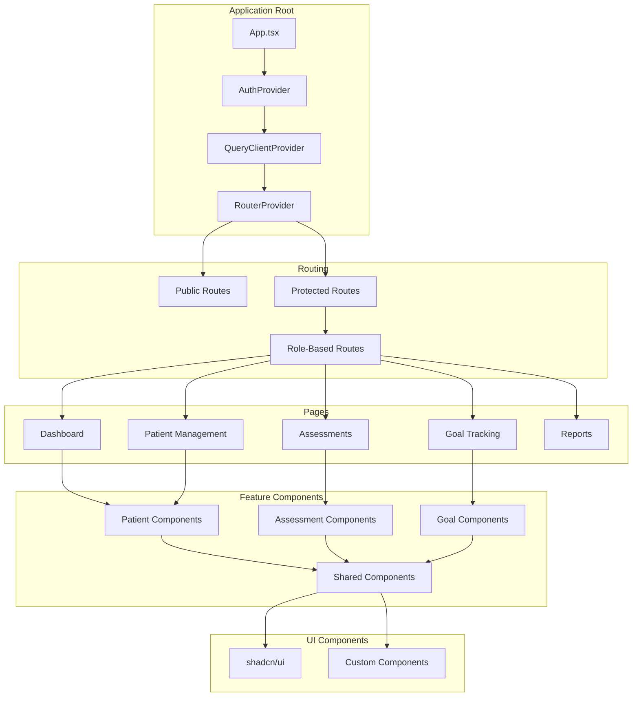
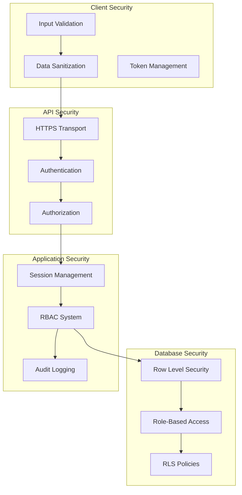
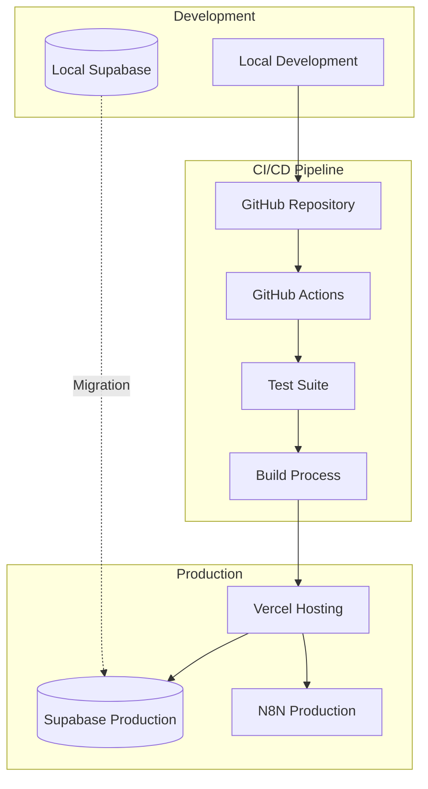

# PsyRehab System Architecture

## Overview

PsyRehab is a mental health rehabilitation management platform built with modern web technologies. This document provides visual representations of the system architecture.

## 1. High-Level System Architecture

## 2. Authentication Flow

## 3. AI Recommendation Flow

## 4. Data Flow Architecture

## 5. Component Architecture

## 6. Security Architecture

## 7. Deployment Architecture

## Technology Stack Summary

### Frontend
- **Framework**: React 19.1.0 with TypeScript 5.8.3
- **Build Tool**: Vite 6.3.5
- **Styling**: TailwindCSS 3.4.17 + shadcn/ui
- **State Management**: TanStack Query 5.80.5
- **Routing**: React Router DOM 7.6.2
- **Forms**: React Hook Form 7.58.1 + Zod 3.25.67
- **Charts**: Chart.js 3.10.1, Recharts 2.15.0

### Backend
- **Database**: Supabase (PostgreSQL)
- **Authentication**: Supabase Auth (PKCE)
- **Real-time**: Supabase Realtime
- **Security**: Row Level Security (RLS)
- **AI Integration**: N8N Webhook

### Development
- **Package Manager**: npm 9+
- **Node Version**: 18.20.0
- **Testing**: Vitest 2.1.8
- **Linting**: ESLint
- **Formatting**: Prettier