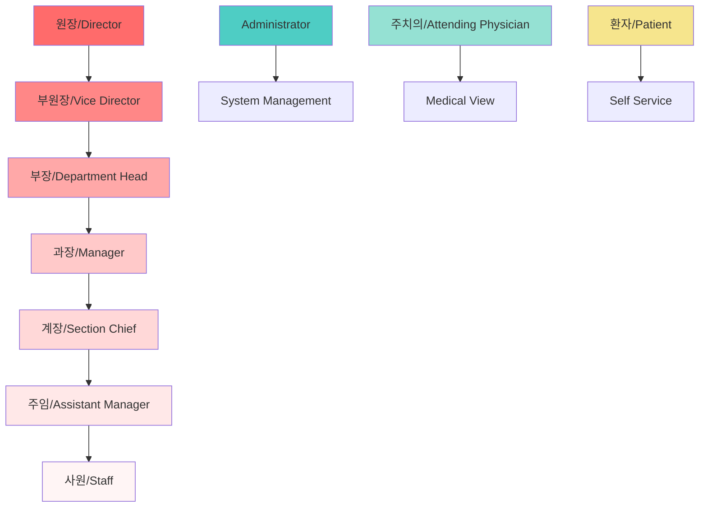
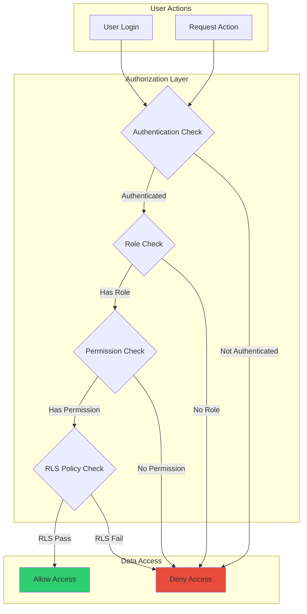
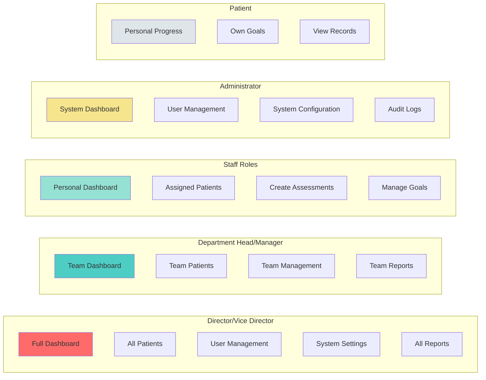
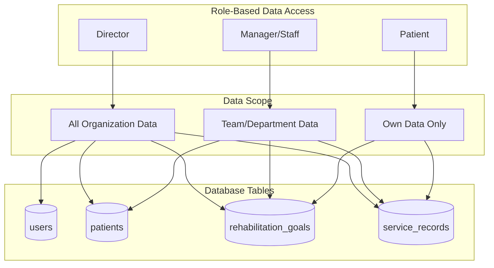

# PsyRehab User Permissions Matrix

## Overview

This document visualizes the role-based access control (RBAC) system in PsyRehab, showing which roles have access to which features and data.

## 1. Role Hierarchy



## 2. Permission Matrix

```mermaid
heatmap x="Permissions" y="Roles"
    "Director" : [100, 100, 100, 100, 100, 100, 100, 100, 100]
    "Vice Director" : [90, 90, 90, 90, 90, 90, 90, 90, 80]
    "Department Head" : [80, 80, 80, 80, 80, 80, 70, 70, 60]
    "Manager" : [70, 70, 70, 70, 70, 60, 60, 50, 40]
    "Section Chief" : [60, 60, 60, 60, 50, 50, 40, 30, 20]
    "Assistant Manager" : [50, 50, 50, 40, 40, 30, 20, 20, 10]
    "Staff" : [40, 40, 30, 30, 20, 20, 10, 10, 0]
    "Administrator" : [100, 100, 0, 0, 0, 100, 100, 100, 100]
    "Attending Physician" : [0, 50, 100, 50, 50, 0, 0, 0, 0]
    "Patient" : [0, 0, 10, 0, 10, 0, 0, 0, 0]
```

## 3. Detailed Permissions Table

| Permission Category | Director | Vice Director | Dept Head | Manager | Section Chief | Asst Manager | Staff | Administrator | Physician | Patient |
|-------------------|----------|---------------|-----------|----------|---------------|--------------|-------|---------------|-----------|---------|
| **User Management** |
| Create Users | ✅ | ✅ | ✅ | ✅ | ❌ | ❌ | ❌ | ✅ | ❌ | ❌ |
| Update Users | ✅ | ✅ | ✅ | ✅ | ✅ | ❌ | ❌ | ✅ | ❌ | ❌ |
| Delete Users | ✅ | ✅ | ✅ | ❌ | ❌ | ❌ | ❌ | ✅ | ❌ | ❌ |
| View All Users | ✅ | ✅ | ✅ | ✅ | ✅ | ✅ | ❌ | ✅ | ❌ | ❌ |
| **Patient Management** |
| Create Patients | ✅ | ✅ | ✅ | ✅ | ✅ | ✅ | ✅ | ❌ | ❌ | ❌ |
| Update Patients | ✅ | ✅ | ✅ | ✅ | ✅ | ✅ | ✅ | ❌ | ✅ | ❌ |
| Delete Patients | ✅ | ✅ | ✅ | ❌ | ❌ | ❌ | ❌ | ❌ | ❌ | ❌ |
| View All Patients | ✅ | ✅ | ✅ | ✅ | ✅ | ✅ | ✅ | ❌ | ✅ | ❌ |
| View Own Patients | ✅ | ✅ | ✅ | ✅ | ✅ | ✅ | ✅ | ❌ | ✅ | ✅ |
| **Assessment Management** |
| Create Assessments | ✅ | ✅ | ✅ | ✅ | ✅ | ✅ | ✅ | ❌ | ❌ | ❌ |
| Update Assessments | ✅ | ✅ | ✅ | ✅ | ✅ | ✅ | ✅ | ❌ | ❌ | ❌ |
| View Assessments | ✅ | ✅ | ✅ | ✅ | ✅ | ✅ | ✅ | ❌ | ✅ | ✅ |
| **Goal Management** |
| Create Goals | ✅ | ✅ | ✅ | ✅ | ✅ | ✅ | ✅ | ❌ | ❌ | ❌ |
| Update Goals | ✅ | ✅ | ✅ | ✅ | ✅ | ✅ | ✅ | ❌ | ❌ | ❌ |
| Evaluate Goals | ✅ | ✅ | ✅ | ✅ | ✅ | ✅ | ✅ | ❌ | ✅ | ❌ |
| View Goals | ✅ | ✅ | ✅ | ✅ | ✅ | ✅ | ✅ | ❌ | ✅ | ✅ |
| **Service Records** |
| Create Records | ✅ | ✅ | ✅ | ✅ | ✅ | ✅ | ✅ | ❌ | ❌ | ❌ |
| Update Records | ✅ | ✅ | ✅ | ✅ | ✅ | ✅ | ✅ | ❌ | ❌ | ❌ |
| View Records | ✅ | ✅ | ✅ | ✅ | ✅ | ✅ | ✅ | ❌ | ✅ | ✅ |
| **System Configuration** |
| Manage Roles | ✅ | ✅ | ❌ | ❌ | ❌ | ❌ | ❌ | ✅ | ❌ | ❌ |
| System Settings | ✅ | ✅ | ❌ | ❌ | ❌ | ❌ | ❌ | ✅ | ❌ | ❌ |
| View Audit Logs | ✅ | ✅ | ✅ | ❌ | ❌ | ❌ | ❌ | ✅ | ❌ | ❌ |
| **Reports** |
| Generate Reports | ✅ | ✅ | ✅ | ✅ | ✅ | ❌ | ❌ | ✅ | ❌ | ❌ |
| View All Reports | ✅ | ✅ | ✅ | ✅ | ❌ | ❌ | ❌ | ✅ | ❌ | ❌ |
| Export Data | ✅ | ✅ | ✅ | ✅ | ❌ | ❌ | ❌ | ✅ | ❌ | ❌ |
| **Announcements** |
| Create Announcements | ✅ | ✅ | ✅ | ❌ | ❌ | ❌ | ❌ | ✅ | ❌ | ❌ |
| Edit Announcements | ✅ | ✅ | ✅ | ❌ | ❌ | ❌ | ❌ | ✅ | ❌ | ❌ |
| View Announcements | ✅ | ✅ | ✅ | ✅ | ✅ | ✅ | ✅ | ✅ | ✅ | ✅ |

## 4. Permission Flow Diagram



## 5. Role-Based UI Access



## 6. Data Access Patterns



## 7. Special Permission Rules

### Hierarchical Access
- Higher roles inherit all permissions of lower roles
- Director (원장) has full system access
- Vice Director (부원장) has near-full access except some system configurations

### Cross-Role Permissions
- **Administrator**: Full technical access but no patient data access
- **Attending Physician**: Read-only access to patient medical data
- **Patient**: Can only view their own data and progress

### Data Ownership Rules
1. **Social Workers** can only access patients assigned to them
2. **Managers** can access all patients in their department
3. **Directors** can access all patients in the organization
4. **Patients** can only see their own information

### Time-Based Restrictions
- Some actions may be restricted based on business hours
- Audit logs track all permission-based actions
- Session timeouts enforce security

## 8. Permission Implementation

```typescript
// Example permission check
hasPermission(userId: string, permission: string): boolean

// Common permissions:
- 'users.create'
- 'users.update'
- 'users.delete'
- 'patients.create'
- 'patients.view_all'
- 'goals.evaluate'
- 'reports.generate'
- 'system.configure'
```

## Security Notes

1. **Least Privilege Principle**: Users only get permissions necessary for their role
2. **Separation of Duties**: Administrative and clinical permissions are separated
3. **Audit Trail**: All permission-based actions are logged
4. **Regular Reviews**: Permissions should be reviewed quarterly
5. **Emergency Access**: Break-glass procedures for emergency patient access