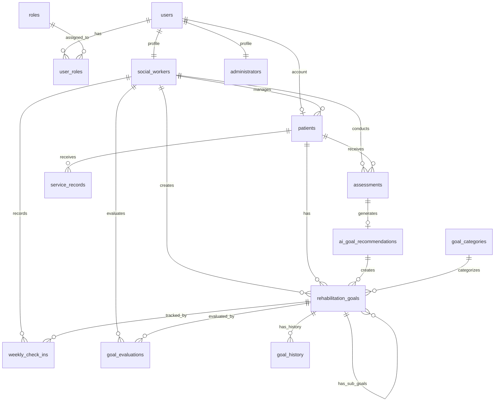
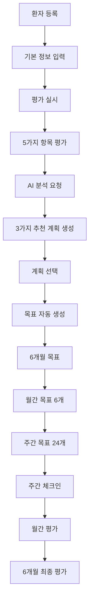

# 정신장애인 재활 목표 관리 플랫폼 - 데이터베이스 기술 문서

## 1. 개요

### 1.1 시스템 소개

본 시스템은 정신장애인의 재활 목표를 체계적으로 관리하는 플랫폼으로, 사회복지사가 환자의 상태를 평가하고 AI 기반 맞춤형 재활 계획을 수립하여 6개월 단위로 관리할 수 있도록 지원합니다.

### 1.2 핵심 기능

- **평가 기반 목표 설정**: 5가지 평가 항목을 통한 환자 상태 분석
- **AI 추천 시스템**: 평가 결과 기반 맞춤형 재활 계획 제안
- **계층적 목표 관리**: 6개월 → 월간 → 주간 목표의 체계적 관리
- **진행 상황 추적**: 주간 체크인 및 평가를 통한 목표 달성률 모니터링
- **대시보드 및 통계**: 환자별, 사회복지사별 성과 분석

### 1.3 기술 스택

- **Database**: PostgreSQL (Supabase)
- **Authentication**: Supabase Auth
- **Security**: Row Level Security (RLS)
- **API**: Auto-generated REST API by Supabase

## 2. 데이터베이스 구조

### 2.1 ERD (Entity Relationship Diagram)

### 2.2 테이블 상세 명세

#### 2.2.1 사용자 관리 테이블

##### users (Supabase Auth 내장)

- 시스템 사용자 기본 정보
- 이메일 기반 인증

##### roles

| 컬럼명      | 타입        | 설명                                           |
| ----------- | ----------- | ---------------------------------------------- |
| id          | UUID        | PK                                             |
| role_name   | VARCHAR(50) | 역할명 (social_worker, administrator, patient) |
| description | TEXT        | 역할 설명                                      |

##### user_roles

- 사용자-역할 다대다 매핑
- 복합 PK: (user_id, role_id)

##### social_workers

| 컬럼명         | 타입         | 설명              |
| -------------- | ------------ | ----------------- |
| user_id        | UUID         | PK, FK (users.id) |
| full_name      | VARCHAR(100) | 성명              |
| employee_id    | VARCHAR(50)  | 직원번호          |
| department     | VARCHAR(100) | 부서              |
| contact_number | VARCHAR(20)  | 연락처            |
| is_active      | BOOLEAN      | 활성 상태         |

##### administrators

- 시스템 관리자 정보
- social_workers와 유사한 구조

#### 2.2.2 환자 관리 테이블

##### patients

| 컬럼명                   | 타입         | 설명                      |
| ------------------------ | ------------ | ------------------------- |
| id                       | UUID         | PK                        |
| user_id                  | UUID         | FK (users.id), 환자 계정  |
| patient_identifier       | VARCHAR(50)  | 환자 고유 번호            |
| full_name                | VARCHAR(100) | 성명                      |
| birth_date               | DATE         | 생년월일                  |
| gender                   | VARCHAR(10)  | 성별                      |
| diagnosis                | VARCHAR(255) | 진단명                    |
| diagnosis_code           | VARCHAR(10)  | 진단 코드                 |
| diagnosis_date           | DATE         | 진단일                    |
| initial_diagnosis_date   | DATE         | 초진일                    |
| phone_number             | VARCHAR(20)  | 연락처                    |
| emergency_contact        | JSONB        | 비상연락처                |
| address                  | JSONB        | 주소                      |
| primary_social_worker_id | UUID         | 담당 사회복지사           |
| status                   | VARCHAR(20)  | 상태 (active, discharged) |

#### 2.2.3 평가 관리 테이블

##### assessments

| 컬럼명            | 타입        | 설명                                                 |
| ----------------- | ----------- | ---------------------------------------------------- |
| id                | UUID        | PK                                                   |
| patient_id        | UUID        | FK (patients.id)                                     |
| focus_time        | VARCHAR(20) | 집중 가능 시간 (5min, 15min, 30min, 1hour)           |
| motivation_level  | INTEGER     | 동기 수준 (1-10)                                     |
| past_successes    | TEXT[]      | 과거 성공 경험                                       |
| constraints       | TEXT[]      | 제약사항                                             |
| social_preference | VARCHAR(20) | 사회적 선호도 (individual, small_group, large_group) |
| assessment_date   | DATE        | 평가일                                               |
| notes             | TEXT        | 메모                                                 |
| assessed_by       | UUID        | FK (social_workers.user_id)                          |

##### assessment_options

- 평가 항목별 선택지 관리
- 드롭다운 옵션 제공

#### 2.2.4 목표 관리 테이블

##### goal_categories

| 컬럼명      | 타입         | 설명       |
| ----------- | ------------ | ---------- |
| id          | UUID         | PK         |
| name        | VARCHAR(100) | 카테고리명 |
| description | TEXT         | 설명       |
| icon        | VARCHAR(50)  | 아이콘     |
| color       | VARCHAR(7)   | 색상 코드  |

##### rehabilitation_goals

| 컬럼명                      | 타입        | 설명                                                  |
| --------------------------- | ----------- | ----------------------------------------------------- |
| id                          | UUID        | PK                                                    |
| patient_id                  | UUID        | FK (patients.id)                                      |
| parent_goal_id              | UUID        | FK (자기참조)                                         |
| title                       | TEXT        | 목표 제목                                             |
| description                 | TEXT        | 목표 설명                                             |
| category_id                 | UUID        | FK (goal_categories.id)                               |
| goal_type                   | VARCHAR(20) | 목표 유형 (six_month, monthly, weekly)                |
| sequence_number             | INTEGER     | 순서 번호                                             |
| start_date                  | DATE        | 시작일                                                |
| end_date                    | DATE        | 종료일                                                |
| status                      | VARCHAR(20) | 상태 (pending, active, completed, on_hold, cancelled) |
| progress                    | NUMERIC     | 진행률 (0-100)                                        |
| actual_completion_rate      | INTEGER     | 실제 달성률                                           |
| target_completion_rate      | INTEGER     | 목표 달성률                                           |
| priority                    | VARCHAR(20) | 우선순위                                              |
| is_ai_suggested             | BOOLEAN     | AI 추천 여부                                          |
| source_recommendation_id    | UUID        | FK (ai_goal_recommendations.id)                       |
| is_from_ai_recommendation   | BOOLEAN     | AI 추천 기반 여부                                     |
| created_by_social_worker_id | UUID        | FK (social_workers.user_id)                           |

##### weekly_check_ins

| 컬럼명           | 타입    | 설명                         |
| ---------------- | ------- | ---------------------------- |
| id               | UUID    | PK                           |
| goal_id          | UUID    | FK (rehabilitation_goals.id) |
| week_number      | INTEGER | 주차                         |
| check_in_date    | DATE    | 체크인 날짜                  |
| is_completed     | BOOLEAN | 완료 여부                    |
| completion_notes | TEXT    | 완료 메모                    |
| obstacles_faced  | TEXT    | 직면한 장애물                |
| support_needed   | TEXT    | 필요한 지원                  |
| mood_rating      | INTEGER | 기분 평가 (1-5)              |
| checked_by       | UUID    | FK (social_workers.user_id)  |

##### goal_evaluations

| 컬럼명           | 타입        | 설명                                   |
| ---------------- | ----------- | -------------------------------------- |
| id               | UUID        | PK                                     |
| goal_id          | UUID        | FK (rehabilitation_goals.id)           |
| evaluation_type  | VARCHAR(20) | 평가 유형 (weekly, monthly, six_month) |
| evaluation_date  | DATE        | 평가일                                 |
| completion_rate  | INTEGER     | 완료율 (0-100)                         |
| evaluation_notes | TEXT        | 평가 내용                              |
| strengths        | JSONB       | 강점                                   |
| challenges       | JSONB       | 도전 과제                              |
| next_steps       | JSONB       | 다음 단계                              |
| evaluated_by     | UUID        | FK (social_workers.user_id)            |

##### goal_history

| 컬럼명          | 타입        | 설명                                                    |
| --------------- | ----------- | ------------------------------------------------------- |
| id              | UUID        | PK                                                      |
| goal_id         | UUID        | FK (rehabilitation_goals.id)                            |
| changed_by      | UUID        | FK (social_workers.user_id)                             |
| change_type     | VARCHAR(50) | 변경 유형 (created, updated, status_changed, completed) |
| previous_values | JSONB       | 이전 값                                                 |
| new_values      | JSONB       | 새 값                                                   |
| change_reason   | TEXT        | 변경 사유                                               |
| created_at      | TIMESTAMPTZ | 변경 시각                                               |

#### 2.2.5 AI 추천 테이블

##### ai_goal_recommendations

| 컬럼명              | 타입        | 설명                        |
| ------------------- | ----------- | --------------------------- |
| id                  | UUID        | PK                          |
| patient_id          | UUID        | FK (patients.id)            |
| assessment_id       | UUID        | FK (assessments.id)         |
| assessment_data     | JSONB       | 평가 데이터 스냅샷          |
| recommendation_date | DATE        | 추천일                      |
| patient_analysis    | JSONB       | 환자 분석                   |
| six_month_goals     | JSONB       | 6개월 목표 (3개)            |
| monthly_plans       | JSONB       | 월간 계획                   |
| weekly_plans        | JSONB       | 주간 계획                   |
| execution_strategy  | JSONB       | 실행 전략                   |
| success_indicators  | JSONB       | 성공 지표                   |
| is_active           | BOOLEAN     | 활성 상태                   |
| applied_at          | TIMESTAMPTZ | 적용 시각                   |
| applied_by          | UUID        | FK (social_workers.user_id) |

#### 2.2.6 서비스 기록 테이블

##### service_records

| 컬럼명             | 타입         | 설명                        |
| ------------------ | ------------ | --------------------------- |
| id                 | UUID         | PK                          |
| patient_id         | UUID         | FK (patients.id)            |
| social_worker_id   | UUID         | FK (social_workers.user_id) |
| service_date_time  | TIMESTAMPTZ  | 서비스 일시                 |
| duration_minutes   | INTEGER      | 소요 시간                   |
| service_type       | VARCHAR(100) | 서비스 유형                 |
| service_category   | VARCHAR(50)  | 서비스 카테고리             |
| is_group_session   | BOOLEAN      | 그룹 세션 여부              |
| participants_count | INTEGER      | 참가자 수                   |
| notes              | TEXT         | 메모                        |
| location           | VARCHAR(255) | 장소                        |

### 2.3 주요 뷰(View)

#### goal_hierarchy

- 목표의 계층 구조를 시각화
- 6개월 → 월간 → 주간 목표의 트리 구조 표현

#### patient_current_progress

- 환자별 현재 진행 상황 요약
- 활성 목표, 진행률, 다음 평가 예정일 등

#### social_worker_dashboard

- 사회복지사별 담당 환자 및 목표 현황
- 최근 활동 통계

#### goal_metrics

- 환자별 목표 관련 종합 통계
- 목표 수, 완료율, AI 추천 사용률 등

#### assessment_statistics

- 환자별 평가 통계
- 평균 동기 수준, 선호도 패턴 등

## 3. 핵심 비즈니스 로직

### 3.1 워크플로우

### 3.2 주요 함수

#### create_assessment_and_get_recommendations()

평가를 생성하고 AI 추천을 위한 준비

#### save_ai_recommendation_and_create_goals()

AI 추천을 저장하고 선택된 계획으로 계층적 목표 자동 생성

#### get_patient_info_for_ai()

AI 분석을 위한 환자 정보 조회 (나이, 성별, 진단, 이환기간 포함)

#### calculate_goal_completion_rate()

목표별 완료율 계산 및 업데이트

#### get_patient_statistics()

환자별 종합 통계 (평가 횟수, 목표 달성률, 평균 기분 등)

#### validate_goal_hierarchy()

목표 계층 구조의 데이터 정합성 검증

### 3.3 트리거

#### update_updated_at_column()

모든 테이블의 updated_at 필드 자동 업데이트

#### record_goal_history()

목표 변경 시 자동으로 이력 기록

#### update_goal_completion()

하위 목표 완료 시 상위 목표 진행률 자동 계산

## 4. 보안 및 권한 관리

### 4.1 Row Level Security (RLS)

모든 테이블에 RLS 적용으로 데이터 접근 제어:

- **관리자**: 모든 데이터 접근 가능
- **사회복지사**:
  - 담당 환자 데이터 전체 권한
  - 본인이 생성한 목표/평가 수정 권한
  - 다른 환자 데이터 읽기 권한
- **환자**:
  - 본인 데이터만 읽기 권한
  - 수정 불가

### 4.2 헬퍼 함수

- `user_has_role()`: 사용자 역할 확인
- `is_patient_social_worker()`: 담당 사회복지사 여부 확인
- `is_social_worker()`: 사회복지사 여부 확인
- `is_administrator()`: 관리자 여부 확인

## 5. 성능 최적화

### 5.1 인덱스 전략

#### 기본 인덱스

- 모든 FK에 인덱스 생성
- 자주 조회되는 필드 (patient_id, status, goal_type 등)

#### 복합 인덱스

- `idx_rehabilitation_goals_patient_type`: (patient_id, goal_type)
- `idx_rehabilitation_goals_parent_status`: (parent_goal_id, status)
- `idx_assessments_patient_date`: (patient_id, assessment_date DESC)

### 5.2 쿼리 최적화

- 계층적 쿼리를 위한 재귀 CTE 사용
- 통계 계산을 위한 집계 함수 최적화
- 불필요한 JOIN 최소화

## 6. 데이터 무결성

### 6.1 제약 조건

- **CHECK 제약**:

  - goal_type IN ('six_month', 'monthly', 'weekly')
  - status IN ('pending', 'active', 'completed', 'on_hold', 'cancelled')
  - motivation_level BETWEEN 1 AND 10
  - completion_rate BETWEEN 0 AND 100

- **UNIQUE 제약**:
  - patients.patient_identifier
  - social_workers.employee_id
  - roles.role_name

### 6.2 참조 무결성

- CASCADE DELETE: 환자 삭제 시 관련 데이터 자동 삭제
- RESTRICT: 사회복지사 삭제 시 관련 기록 있으면 삭제 방지
- SET NULL: 담당자 변경 시 기존 참조 NULL 처리

## 7. 확장성 고려사항

### 7.1 향후 기능 확장

- **모바일 앱 지원**: 환자용 모바일 앱을 위한 API 준비
- **다국어 지원**: 텍스트 필드의 다국어 저장 구조
- **외부 시스템 연동**: 병원 EMR 시스템과의 데이터 교환

### 7.2 스케일링 전략

- **파티셔닝**: 환자 수 증가 시 날짜 기반 파티셔닝
- **아카이빙**: 오래된 데이터의 별도 테이블 이관
- **캐싱**: 자주 조회되는 통계 데이터 캐싱

## 8. 모니터링 및 유지보수

### 8.1 모니터링 지표

- 활성 사용자 수
- 일일 평가 수
- 목표 달성률 추이
- API 응답 시간

### 8.2 정기 유지보수

- 월간: 데이터 정합성 검증
- 분기별: 인덱스 리빌드
- 반기별: 아카이브 데이터 이관

## 9. 백업 및 복구

### 9.1 백업 전략

- 일일 자동 백업 (Supabase 제공)
- 주간 전체 백업
- 중요 트랜잭션 실시간 복제

### 9.2 복구 절차

- Point-in-Time Recovery 지원
- 트랜잭션 로그 기반 복구
- 재해 복구 계획 수립

## 10. 결론

본 데이터베이스는 정신장애인 재활 목표 관리의 전체 생명주기를 지원하도록 설계되었습니다. 평가 기반 AI 추천, 계층적 목표 관리, 진행 상황 추적, 성과 분석까지 통합된 시스템으로 구축되어 있으며, 확장성과 유지보수성을 고려한 설계로 장기적인 운영이 가능합니다.
